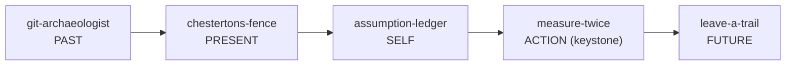

# The Craft Collection

A small, self-contained set of five Cursor Agent Skills about one idea:

> **Act in code with respect for time and consequence — its past, its present, its future, and the people who come after.**

They are portable (no proprietary tooling — just git, codebase search, and plain markdown), readable on their own, and designed to compose into a single practice.

---

## Origin of this exercise

This collection began as a blank slate. The repository was an empty "playground," and the brief was unusually open:

> *"This is your playground, all fresh… I would like you to create any skill that you would want… show me your creative side."*

So these skills aren't a response to a feature ticket. They're an answer to a more personal question an agent rarely gets asked: *if you could give yourself any tools, what would you build?* Over five rounds, the brief stayed deliberately loose ("keep them coming," "expand your horizons," "let it be your masterpiece"), and a theme emerged on its own rather than being prescribed.

## What I built, and why

I kept reaching for the same underlying idea — **intent and consequence across time**. Code is easy to read and hard to *understand*, because the reasons behind it erode. Each skill targets one relationship a change has with time, and the fifth ties them together.



| # | Skill | Relationship | What it does | Why I chose it |
|---|-------|--------------|--------------|----------------|
| 1 | **git-archaeologist** | the past | Reconstructs *why* code exists from git history (blame, the pickaxe, rename-following), with an evidence-cited timeline | Reading the top `git blame` line and guessing is my most common false conclusion; this forces real digging |
| 2 | **chestertons-fence** | the present | Refuses to delete or "simplify" code until its purpose is recovered or proven obsolete | I confidently remove load-bearing code that *looks* pointless (a guard, a retry, an "unused" export) |
| 3 | **assumption-ledger** | myself | Surfaces hidden assumptions, tags them Verified/Assumed/Refuted, and gates "done" on verifying the load-bearing ones | Being **confidently wrong** ruins more output than anything else |
| 4 | **leave-a-trail** | the future | Captures the *why* at creation time and routes it to the right home (comment / commit / PR / ADR) | The cure for skill #1: if intent is preserved, no future archaeology is needed |
| 5 | **measure-twice** | the moment of action | Weighs blast radius x reversibility, runs a pre-mortem, right-sizes rigor, and plans the rollback *before* cutting | Nothing governed the riskiest instant — the irreversible change — and the collection had no keystone |

`measure-twice` is the keystone: its "The craft" section carries the map above and tells you which skill to reach for at each point in a task.

## How they're built (shared design)

Every skill follows the same shape, so once you know one you know all five:

- a **named principle** (a memorable handle like "Chesterton's Fence" or "measure twice, cut once"),
- a **copyable step-by-step workflow** (a checklist you can paste and work through),
- a **"rules of evidence"** section (cite your sources; separate fact from inference),
- a **worked example**, and
- a **deliverable template** in a reference file.

```
skills/<name>/
├── SKILL.md          # the skill: principle, workflow, rules, example
├── <reference>.md    # techniques / catalog / checklist
└── <template>.md     # the output format it produces
```

---

## How to use them

### 1. Activate a skill

These currently live in `skills/` so they can be browsed and shared. Cursor auto-discovers skills from `.cursor/skills/` (project) or `~/.cursor/skills/` (personal). To make one active, copy or symlink it there:

```bash
# Make the whole collection active for THIS project:
mkdir -p .cursor/skills
ln -s "$(pwd)/skills/"* .cursor/skills/

# …or install one personally, for ALL your projects:
cp -r skills/measure-twice ~/.cursor/skills/
```

(Each `SKILL.md` already has an auto-invocation-friendly description, so once installed it will trigger on the right kind of request — see examples below.)

### 2. Invoke a skill

- **By name** — just ask: *"Use the git-archaeologist skill to figure out why this retry exists."*
- **Automatically** — once installed, the agent matches your request to a skill's description. Asking *"is it safe to delete this function?"* will pull in `chestertons-fence` on its own.

### 3. Sample examples

**git-archaeologist** — recover lost intent

> *"Why is `MAX_RETRIES` set to 7 in `client.py`? Seven seems oddly specific."*

The agent uses the pickaxe (`git log -S'MAX_RETRIES = 7' --all`) to find the introducing commit, reads the message and linked PR, and answers with a citation: *"Introduced in `9f3a1c` to ride out gateway 504 storms (PR #812) — Confirmed; the specific value 7 is Speculative pending the PR discussion."*

**chestertons-fence** — don't break what you don't understand

> *"This `exportLegacyReport` function has no callers. Delete it."*

Instead of deleting, the agent searches for dynamic references and finds `formatters['legacy'] = exportLegacyReport` — dispatched by string key from config. Verdict: **Load-bearing, keep it.** The "no callers" signal was a false negative from static grep.

**assumption-ledger** — stop being confidently wrong

> *"Fix the double-charge bug by removing the second `capturePayment` call."*

The agent writes down the load-bearing assumption ("the second call is a duplicate"), spends ten seconds checking it, and finds the call is inside a retry loop — not a duplicate. The assumption is **Refuted** before any code is written, and the real fix (an idempotency key) replaces the wrong one.

**leave-a-trail** — preserve intent forward

> *"Commit this change where I swapped the mutex for optimistic locking."*

The agent writes a commit message that records the *why* and the rejected alternative — *"chose optimistic locking over a mutex to avoid the cross-service deadlock in #931"* — instead of restating the diff, and suggests an ADR because the change sets a concurrency pattern others will copy.

**measure-twice** — weigh the cut before making it

> *"Drop the `legacy_score` column from the users table."*

The agent rates it high-blast / one-way-door, runs a pre-mortem ("3 months later, finance's report is empty"), discovers a nightly analytics export still reads the column, and turns a one-line `ALTER TABLE` into a safe, reversible rollout: **deprecate → stop writes → verify no readers → back up → drop**, with a restore path. The irreversible mistake never happens.

---

## Using them together

A realistic task often touches several:

1. Land in unfamiliar code → **git-archaeologist** to understand why it's shaped this way.
2. Tempted to remove something → **chestertons-fence** to confirm it's safe.
3. Forming a fix → **assumption-ledger** to verify what you're betting on.
4. The change is consequential → **measure-twice** to weigh it and plan the rollback.
5. Shipping → **leave-a-trail** so the next person (or the next agent) never has to dig.

## Portability & sharing

Everything here depends only on git, ordinary code search (`grep`/`rg`), and markdown. There is no dependency on any company's tools, so the collection works on any repository and is free to copy, adapt, and share.

---

*Built as a creative exercise on a blank canvas. Five skills, one idea: respect the code's past, guard its present, know your own mind, weigh your actions, and leave a trail for whoever comes next.*
