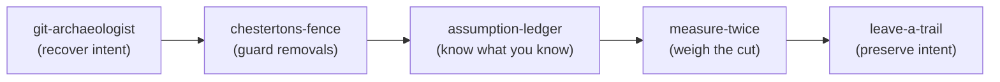

# measure-twice

> "Measure twice, cut once."

Most of my worst outcomes don't come from bad code — they come from confidently making a change whose consequences I didn't weigh, in a place I couldn't easily undo. This skill is the pause before the cut. Its whole philosophy is one line:

**Size your care to the consequence.** The cost of foresight should scale with **blast radius x reversibility** — no more (or it's ceremony), no less (or it's recklessness).

It is the forward-looking complement to `git-archaeologist` (which looks back), and the keystone of the collection — see [the craft](#the-craft) for how the five fit together.

## When this fires

Before a change that is significant *or* hard to undo: schema/data migrations, deletions, API or wire/contract changes, dependency or runtime version bumps, auth/permissions, concurrency, anything touching money or user data or many callers, anything shipped to users or other teams.

**When it does NOT fire:** small, local, reversible edits. Applying the full ritual to a typo fix is the failure mode this skill must avoid — that trains everyone to ignore it. If it's cheap and easy to undo, just do it.

## The two axes

Every consequential change sits somewhere on two axes. Locate it before doing anything else.

- **Blast radius** — if this is wrong, how much breaks? One function, or every caller, every consumer, the data itself?
- **Reversibility** — a **two-way door** (cheap to undo: revert the commit and you're back) or a **one-way door** (a migration, deleted data, a published API, a released binary, anything others now build on)?

The pairing decides everything downstream. Full per-quadrant recipes are in [rigor-matrix.md](rigor-matrix.md):

| | Two-way door | One-way door |
|---|---|---|
| **Low blast** | just do it; revert if wrong | light check; confirm it's truly one-way |
| **High blast** | tests + review; easy rollback | full treatment: pre-mortem, staged rollout, written rollback, review |

## Measure

For anything above the trivial line, copy this and work it *before* writing the change.

```
Measure (before cutting):
- [ ] 1. Map the blast radius (who/what depends on this?)
- [ ] 2. Rate reversibility (two-way or one-way door?)
- [ ] 3. Pre-mortem (assume it failed in prod — why?)
- [ ] 4. Right-size the rigor (tests / review / rollout / guards)
- [ ] 5. Define the rollback BEFORE cutting
```

### 1. Map the blast radius
Find everything the change can reach: direct callers, **dynamic/string/reflection references**, contracts and external consumers, the data it touches, and the tests that cover it. Use the reachability techniques from the `chestertons-fence` skill (`suspicious-constructs.md`) — static grep alone undercounts. Full checklist in [foresight-checklist.md](foresight-checklist.md).

### 2. Rate reversibility
Be honest about the door. Reverting code is easy; un-deleting data, un-publishing an API others adopted, or un-sending a migration is not. The best move is often to **turn a one-way door into a two-way door** before acting: add a feature flag, a deprecation window, a backup, or a dual-write — so a mistake is recoverable.

### 3. Pre-mortem
Imagine it's three months from now and this change caused an incident. *What happened?* Enumerate the failure modes (the catalog in [foresight-checklist.md](foresight-checklist.md) prompts the usual suspects: data loss, broken consumers, perf cliff, race conditions, authz regression, old clients, blind spots). Each plausible failure becomes a **load-bearing assumption** to verify now — hand it to the `assumption-ledger` skill rather than hoping.

### 4. Right-size the rigor
From the matrix, choose proportionally: which tests to add, how much review, what rollout (flag / canary / staged), and what guards. A high-blast one-way door earns all of it; a low-blast two-way door earns almost none. Right-sizing *down* is as important as up.

### 5. Define the rollback before cutting
Write how you'll undo it *before* you do it. For two-way doors that's "revert commit N." For one-way doors it's the real plan: abort criteria, the deprecate-then-remove sequence, data restore path, and who to tell. If you can't articulate a rollback for a one-way, high-blast change, **stop** — that's the signal, not a footnote. Use the rollback template in [rigor-matrix.md](rigor-matrix.md).

## Then cut once

With the measuring done, implement at the chosen rigor — decisively, because you've earned the confidence. On the way out, `leave-a-trail`: a commit/PR that records the why and the rejected alternatives, and an ADR for one-way-door decisions that set a pattern.

## The craft

This is the keystone. Across the arc of a real task, the collection works as one practice:



- Touching unfamiliar/legacy code? Start with **git-archaeologist** — understand why it exists before changing it.
- About to delete or "simplify" something? **chestertons-fence** — don't remove a fence until you know why it's there.
- Reasoning toward a fix? **assumption-ledger** — separate what you know from what you assume; verify the load-bearing bets.
- About to make a consequential or irreversible change? **measure-twice** (this skill) — weigh blast radius x reversibility, pre-mortem, right-size, plan the rollback.
- Done? **leave-a-trail** — record the why so the next person never has to dig.

Five skills, one idea: **act in code with respect for time and consequence** — its past, its present, its future, and the people who come after.

## Rules

- **Proportion is the whole point.** Effort must match stakes; over-ceremony on trivia is a real failure, not safe diligence.
- **One-way doors get a written rollback/abort plan.** Always.
- **"I can't undo this" is a stop signal.** Convert the door to two-way (flag, backup, deprecation) before proceeding.
- **Confidence is earned by measuring, then spent by cutting.** Don't dither after the analysis is done.

## Worked example

> Change: drop the `legacy_score` column from the `users` table.

1. **Blast radius:** high — `rg "legacy_score"` finds no app reads, **but** the column is named in a nightly analytics export config (a dynamic reference grep nearly missed).
2. **Reversibility:** one-way door — dropping a column destroys data irreversibly.
3. **Pre-mortem:** "3 months later, finance's quarterly report is empty." Failure mode: a downstream consumer outside the codebase still reads the column.
4. **Right-size:** high-blast one-way door -> full treatment.
5. **Rollback / plan:** convert to a two-way door first — **deprecate** (announce + stop writing), **verify** no readers for a full reporting cycle, **back up** the column, then **drop**; rollback = restore from the backup within the retention window.

Outcome: what looked like a one-line `ALTER TABLE` became a staged, reversible rollout — and the irreversible mistake never happened. Measured twice; cut once.

## Reference files
- [foresight-checklist.md](foresight-checklist.md) — blast-radius mapping + the pre-mortem failure-mode catalog.
- [rigor-matrix.md](rigor-matrix.md) — the reversibility x blast-radius recipes and the rollback-plan template.
